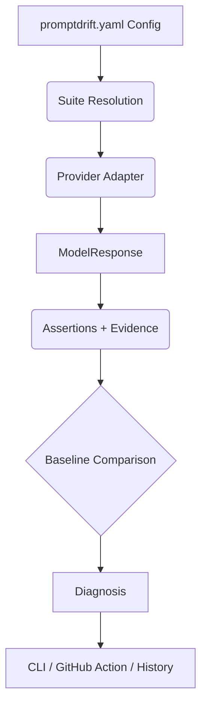

# PromptDrift

[](https://github.com/tanveer-arch/promptdrift/actions/workflows/ci.yml)
[](https://pypi.org/project/promptdrift-ci/)
[](https://pypi.org/project/promptdrift-ci/)
[](LICENSE)

**Your prompt didn't change. Your tests didn't change. So why did your AI behavior change?**

PromptDrift is a Git-native, privacy-conscious CLI and GitHub Action that detects behavioral regression and model drift. It repeatedly probes your unchanged prompts on a schedule, distinguishing actual contract regressions from harmless wording changes, and gathering evidence before you blame a model update.

## The Core Problem

LLM behavior isn't static. Providers update routing, system prompts, or safety filters silently. Traditional testing only runs when *your code* changes.

| State | Prompt | Config | Behavior | Diagnosis |
| :--- | :--- | :--- | :--- | :--- |
| **Traditional CI** | Changed | Changed | Changed | `prompt_changed` |
| **PromptDrift Monitor** | Same | Same | **Changed** | `observed_model_drift` |

## See It in Action

Try a simulated drift incident locally without an API key or paid provider:

```bash
git clone https://github.com/tanveer-arch/promptdrift.git
cd promptdrift
python -m pip install .
promptdrift demo
```

> **Note:** The demo starts a temporary loopback HTTP fixture, saves a passing baseline, then changes only the fixture's response. It will report `observed_model_drift` after three contract failures. This is a synthetic demonstration, not a real model incident or benchmark.

## 60-Second Quickstart

Install the published release:

```bash
pip install promptdrift-ci
```

Initialize your project and run your first checks:

```bash
promptdrift init --directory my-monitor
cd my-monitor
promptdrift test       # Run tests against your current config
promptdrift baseline   # Save passing tests as the canonical baseline
promptdrift monitor --samples 3 # Probe 3 times to detect drift
promptdrift history    # View the results of your monitoring
```

## Example Configuration

Define your deterministic behavioral contracts in `promptdrift.yaml`.

```yaml
version: 2
provider:
  type: openai
  model: gpt-4.1-mini
  api_key_env: OPENAI_API_KEY
  # base_url: https://your-openai-compatible-endpoint.example/v1

defaults:
  temperature: 0
  max_output_tokens: 300

tests:
  - id: refund-policy
    prompt: prompts/support.txt
    variables:
      question: Can I return my order after ten days?
    assertions:
      - type: contains
        value: 30 days
      - type: not_contains
        value: guaranteed
```

## The Core Differentiator: Check vs. Monitor

PromptDrift provides two distinct workflows:

1. **`check` mode (PRs):** *Did the repository change?* Run this in CI on Pull Requests to ensure your intentional prompt or configuration changes don't break existing contracts.
2. **`monitor` mode (Scheduled):** *Did the behavior change even though the monitored inputs stayed the same?* Schedule this to run repeatedly (e.g., daily) against an idle repository to catch silent provider drift.

## What PromptDrift Detects

PromptDrift uses deterministic heuristics, not statistical guesswork. 

| Observation | Diagnosis |
| --- | --- |
| Monitored inputs match, all repeated probes fail contracts | `observed_model_drift` |
| Some repeated probes pass and others fail contracts | `stochastic_behavior` |
| Rendered prompt, settings, provider, or contracts changed | Explicit `*_changed` |
| Output wording changed, but contracts still pass | `output_changed` |
| Timeout, HTTP error, malformed completion | `provider_error` |
| Old baseline lacks provenance or evidence is insufficient | `insufficient_evidence` |

> **Note:** Provider-reported model IDs and fingerprints are treated as supporting evidence, not proof of a vendor-side model weights change.

## GitHub Actions

Run PromptDrift directly in your CI pipeline.

```yaml
name: Scheduled Monitor
on:
  schedule:
    - cron: '0 9 * * *' # Every day at 9 AM
jobs:
  monitor:
    runs-on: ubuntu-latest
    steps:
      - uses: actions/checkout@v4
      - uses: tanveer-arch/promptdrift/action@main
        with:
          mode: monitor
          samples: 3
          create-issue: 'true' # Deduplicated alerts for drift
        env:
          OPENAI_API_KEY: ${{ secrets.OPENAI_API_KEY }}
```

## Supported Providers

- **OpenAI-Compatible:** Supports the text-response Chat Completions API. Set `base_url` for proxies, local inference, or compatible endpoints.
- **Ollama:** Completely local inference. Runs against the Generate API.
- **Mock:** A deterministic local provider for offline testing and CI onboarding. Echoes prompts back with zero cost or latency.

## Deterministic Assertions

PromptDrift evaluates behavior using strict contracts, not subjective LLM judges.

| Assertion | Behavior |
| --- | --- |
| `exact_match` | Character-for-character identical |
| `contains`, `not_contains` | Substring inclusion or exclusion |
| `regex`, `not_regex` | Regular expression matching |
| `json_valid`, `json_schema` | JSON parseability and structural validation |
| `min_length`, `max_length` | Character count boundaries |
| `max_tokens` | Provider-reported token limit |
| `latency_ms` | Maximum acceptable response time |
| `cost_usd` | Cost threshold (where supported) |

## Privacy & Security

Your data is yours. PromptDrift is designed with strict privacy boundaries:

- **No telemetry or hosted dashboard:** Your probes go directly to your configured provider.
- **Minimized history:** `monitor` JSON and SQLite history explicitly omit raw prompts, responses, and API exceptions to prevent accidental data leaks.
- **Safe credentials:** API keys are never read from configuration files, only from environment variables.
- **Hashes, not encryption:** Baselines use SHA-256 hashes of rendered inputs for comparison. *(Note: Hashes of short strings can be guessed, so repository access control still matters)*.
- **Secure Action design:** The GitHub Action prevents arbitrary execution and never exposes provider secrets to untrusted PR code. Legacy reports can contain raw data but are strictly controlled.

## Architecture



## The Capture Workflow

Beyond static testing, PromptDrift can learn from real traffic:
1. **`capture`**: Record real or simulated interactions into local storage.
2. **`learn`**: Turn captured interactions into candidate regression scenarios.
3. **`suggest`**: Generate deterministic behavioral contracts for a scenario.
4. **`promote`**: Move candidate scenarios into your committed regression test suite.

## Is PromptDrift for you?

**Who it is for:**
- AI application developers.
- Teams consuming LLM APIs in production.
- GitHub-centric engineering teams.
- Developers running local models with Ollama.
- Projects needing strict, deterministic behavioral contracts.

**Who it is NOT for:**
- Not a general-purpose evaluator marketplace.
- Not a hosted observability dashboard.
- Not a statistical guarantee of model-weight changes.
- Not an automatic baseline approval system.

## Contributing

We welcome contributions! The engine, providers, and evaluators are intentionally decoupled to make adding features straightforward.

- **Setup:** See [CONTRIBUTING.md](CONTRIBUTING.md) for local development instructions.
- **Run tests:** `python -m pytest`

### Looking for a way to contribute?

Check out our [Roadmap](docs/roadmap.md) for maintainer-reviewed candidates, including:
- OpenAI-compatible fixture coverage.
- Ollama provenance tests.
- Monitoring history reliability.
- Provider error taxonomy.
- GitHub Action report-contract testing.
- Cross-platform CLI coverage.

## Documentation

- [Getting Started](docs/getting-started.md)
- [Monitoring](docs/monitoring.md)
- [Configuration](docs/configuration.md)
- [Baselines](docs/baselines.md)
- [Providers](docs/providers.md)
- [Assertions](docs/assertions.md)
- [Architecture](docs/architecture.md)
- [Competitive Landscape](docs/competitive-landscape.md)

## License

PromptDrift is released under the [MIT License](LICENSE).
